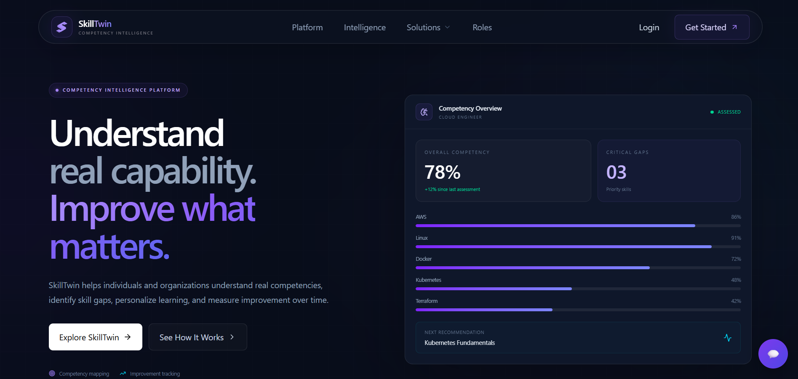
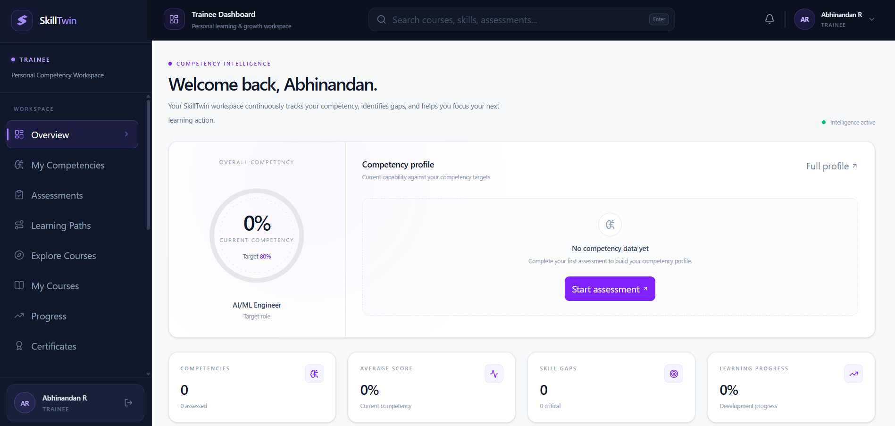
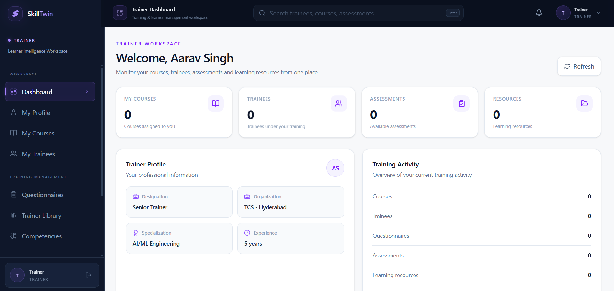
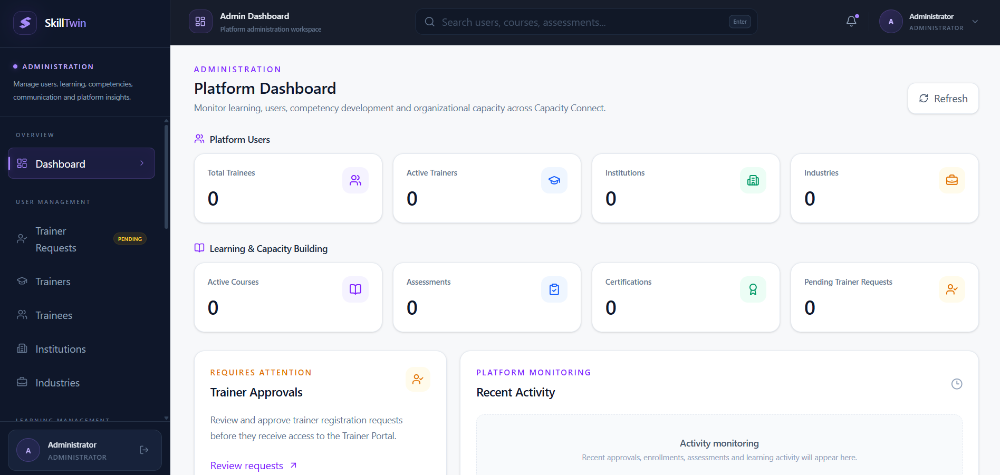
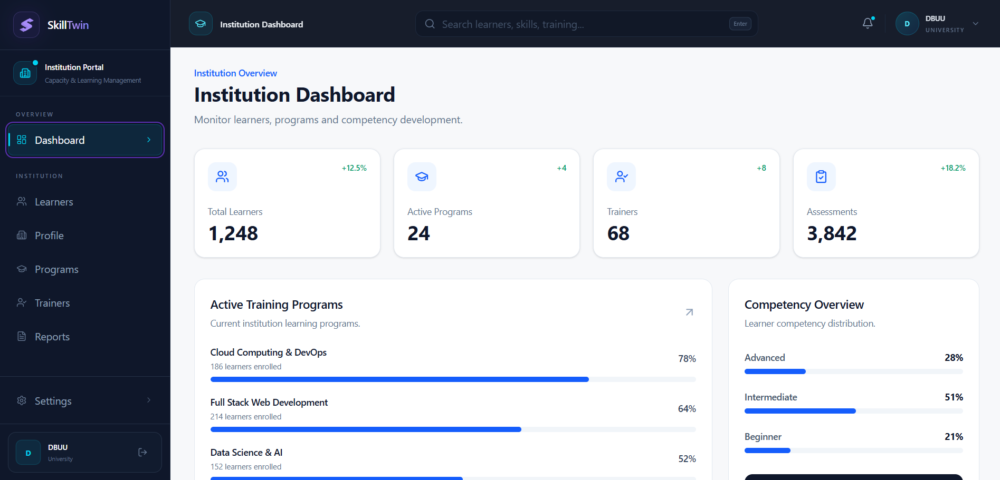
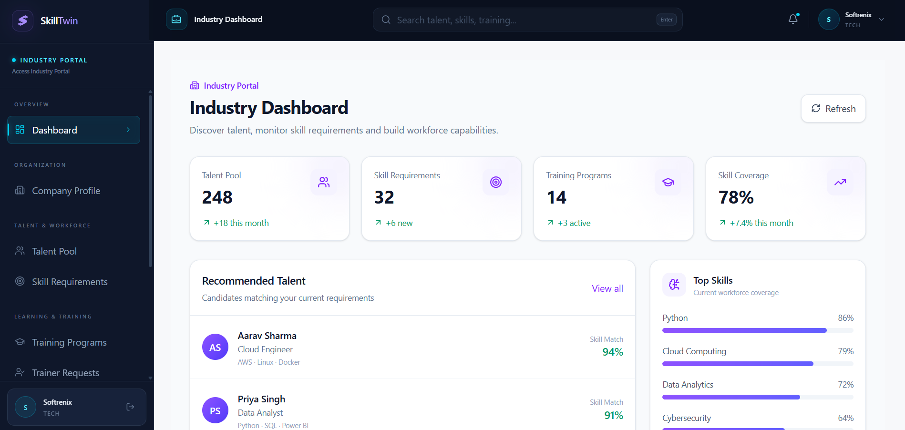

# 🚀 SkillTwin

### AI-Powered Digital Capacity Building, Competency Intelligence & Learning Management Platform

SkillTwin is a modern digital capacity-building and learning management platform designed to help organizations, trainers, institutions, industries, and trainees build, assess, track, and improve professional competencies through a centralized ecosystem.

The platform combines **learning management, competency mapping, assessments, trainer matching, performance analytics, certifications, AI-assisted learning, and organizational intelligence** into one scalable platform.

---

## 🌐 Project Vision

Traditional training platforms mainly focus on course delivery.

SkillTwin goes beyond course delivery by creating a **competency-driven learning ecosystem**.

The platform is designed to answer questions such as:

- What skills does a trainee currently possess?
- What competencies are missing?
- Which courses can help close those gaps?
- Which trainer is best suited for a particular competency?
- How is a trainee progressing?
- Which assessments demonstrate actual competency?
- What certifications and achievements has the trainee earned?
- How can institutions monitor learner development?
- How can industries identify skill-ready candidates?
- How can administrators monitor the entire ecosystem?

The long-term vision of SkillTwin is to create a **digital competency intelligence layer connecting Trainees, Trainers, Institutions, Industries, and Administrators.**

---

## 🎯 Problem Statement

Organizations and educational institutions often manage training, learning resources, assessments, trainers, certificates, and learner performance through disconnected systems.

This creates challenges such as:

- Fragmented learner information
- Difficult competency tracking
- Limited visibility into learner progress
- Manual trainer allocation
- Scattered learning resources
- Inefficient assessments
- Lack of centralized certification records
- Limited performance analytics
- Difficulty identifying skill gaps
- Poor communication between learners and trainers

SkillTwin addresses these challenges through a centralized, role-based digital platform.

---

## 💡 Our Solution

SkillTwin provides a centralized ecosystem with dedicated portals for different stakeholders.

```text
                         SKILLTWIN
                             │
          ┌──────────────────┼──────────────────┐
          │                  │                  │
          ▼                  ▼                  ▼
      TRAINEE             TRAINER             ADMIN
       PORTAL              PORTAL              PORTAL
          │                  │                  │
          └──────────────────┼──────────────────┘
                             │
                    Future Expansion
                             │
                    ┌────────┴────────┐
                    ▼                 ▼
              INSTITUTION         INDUSTRY
                PORTAL             PORTAL
```

Each role gets a dedicated experience based on its responsibilities and requirements.

---

## 👥 User Roles

### 🎓 Trainee

The Trainee Portal enables learners to:

- Create professional profiles
- Add qualifications
- Add work experience
- Manage skills
- Add interests
- Upload certificates
- Browse learning opportunities
- Enroll in courses
- Access learning resources
- Attend assessments
- Attempt subject-wise MCQs
- Track assessment performance
- Monitor competency development
- Receive learning recommendations
- Submit course/content feedback
- Track achievements and certifications

### 👨‍🏫 Trainer

The Trainer Portal enables trainers to:

- Create professional trainer profiles
- Showcase expertise and competencies
- Manage learning content
- Create questionnaires
- Configure assessment deadlines
- Monitor trainee participation
- Track learner performance
- Upload recorded lectures
- Upload presentations
- Upload study materials
- Maintain a trainer resource library
- Support competency-based learning

### 🛡️ Administrator

The Admin Portal provides centralized platform management.

Administrators can manage:

**User Management**
- Trainer requests
- Trainers
- Trainees
- Institutions
- Industries
- User roles
- User activity

**Learning Management**
- Courses
- Assessments
- Certifications
- Learning content

**Competency Management**
- Competencies
- Competency mapping
- Trainer matching

**Communication**
- Notifications
- Announcements
- Achievements

**Insights**
- Analytics
- Reports
- Participation statistics
- Learning performance

The Admin Portal acts as the central control layer of the SkillTwin ecosystem.

### 🏫 Institution Portal

The Institution Portal is designed as a future-ready extension of SkillTwin.

Institutions can eventually use the platform to:

- Manage learners
- Monitor institutional competency development
- Track training participation
- Analyze learner performance
- Manage institutional learning programs
- Identify competency gaps
- Monitor certifications
- Generate reports
- Connect learners with trainers

### 🏢 Industry Portal

The Industry Portal is designed to connect the learning ecosystem with real-world workforce requirements.

Potential capabilities include:

- Industry skill requirements
- Competency demand mapping
- Candidate discovery
- Skill-based candidate filtering
- Industry learning programs
- Internship opportunities
- Workforce readiness insights
- Industry-specific competency frameworks
- Skill gap analysis
- Talent intelligence

This creates a future bridge between:

```text
Learning
   ↓
Competency
   ↓
Assessment
   ↓
Certification
   ↓
Industry Readiness
```

---

## 🧠 Core Platform Concept

SkillTwin is built around the concept of **Competency Intelligence**.

Instead of simply recording course completion, the platform can progressively build a competency profile for every learner.

```text
                    Learner Profile
                          │
                          ▼
                    Skill Inventory
                          │
                          ▼
                    Assessments
                          │
                          ▼
                     Performance
                          │
                          ▼
                    Skill Gap Analysis
                          │
                          ▼
                 Personalized Learning
                          │
                          ▼
                   Improvement Cycle
                          │
                          ▼
                Competency Development
```

---

## ✨ Key Features

### 🔐 Authentication & Authorization
- Secure registration
- Secure login
- JWT-based authentication
- Role-based authorization
- Protected routes
- Separate admin authentication flow
- Active/inactive account handling

### 👤 Professional Profiles

Trainees and trainers can maintain professional profiles containing relevant information such as:

- Personal information
- Qualifications
- Skills
- Interests
- Experience
- Certifications
- Competencies
- Professional information

### 📚 Learning Management

The platform supports:

- Courses
- Learning resources
- Recorded lectures
- Presentations
- Study materials
- Course enrollment
- Learning progress
- Trainer content libraries

### 📝 Assessments

SkillTwin supports competency-oriented assessments through:

- Subject-wise MCQs
- Questionnaires
- Assessment deadlines
- Participation tracking
- Performance tracking
- Assessment analytics

### 🏆 Certifications & Achievements

Learners can maintain records of:

- Certifications
- Achievements
- Completed learning programs
- Assessment accomplishments

### 🧩 Competency Mapping

SkillTwin is designed to map:

```text
Skills
  +
Knowledge
  +
Experience
  +
Assessment Performance
  +
Learning Activity
       ↓
Competency Profile
```

This enables competency-oriented learning rather than simple course completion tracking.

### 🤝 Trainer Matching

The platform is designed to support intelligent trainer matching based on:

- Trainer competencies
- Expertise
- Subject areas
- Learner requirements
- Competency gaps

The long-term objective is to help organizations identify suitable trainers for specific learning requirements.

### 📊 Analytics & Reporting

Administrators can monitor platform-level information including:

- User statistics
- Course statistics
- Assessment participation
- Certification data
- Learning activity
- Performance trends
- Competency information
- Reports

### 🔔 Notifications & Announcements

SkillTwin provides centralized communication capabilities through:

- Notifications
- Announcements
- Learning updates
- New content
- Achievements
- Platform updates

### 🤖 AI Integration

SkillTwin is designed with AI capabilities in mind.

The AI layer can be used to support:

- Skill-gap analysis
- Learning recommendations
- Competency classification
- Personalized learning paths
- Trainer recommendations
- Industry-readiness analysis
- Learning assistance
- Intelligent chatbot interaction

The platform can integrate locally hosted AI models through Ollama, allowing AI functionality without exposing the model server directly to the public internet.

```text
SkillTwin
    │
    ▼
AI Assistant
    │
    ▼
Chatbot API
    │
    ▼
Ollama
    │
    ▼
Local / Hosted LLM
```

### 💬 SkillTwin AI Assistant

The platform includes an AI assistant designed to provide an interactive learning experience.

The chatbot can eventually assist users with:

- Learning questions
- Skill guidance
- Course discovery
- Competency-related questions
- Learning recommendations
- Platform navigation
- General career-learning assistance

The chatbot is designed as a separate service so that it can communicate with an Ollama-powered AI backend.

---

## 🖥️ Platform Screenshots

### 🏠 Home Page



### 🎓 Trainee Portal



### 👨‍🏫 Trainer Portal



### 🛡️ Admin Portal



### 🏫 Institution Portal



### 🏢 Industry Portal



---

## 🏗️ System Architecture

```text
                         ┌─────────────────────┐
                         │       USERS         │
                         └──────────┬──────────┘
                                    │
                                    ▼
                         ┌─────────────────────┐
                         │   React Frontend    │
                         │                     │
                         │ Trainee             │
                         │ Trainer             │
                         │ Admin               │
                         │ Institution         │
                         │ Industry            │
                         └──────────┬──────────┘
                                    │
                                  HTTPS
                                    │
                                    ▼
                         ┌─────────────────────┐
                         │    FastAPI API      │
                         │                     │
                         │ Authentication      │
                         │ Users               │
                         │ Courses             │
                         │ Assessments         │
                         │ Certifications      │
                         │ Analytics           │
                         │ Competencies        │
                         └──────────┬──────────┘
                                    │
                     ┌──────────────┼──────────────┐
                     │              │              │
                     ▼              ▼              ▼
                ┌─────────┐   ┌──────────┐   ┌────────────┐
                │ MySQL   │   │ AI API   │   │ File Store │
                │ Database│   │          │   │            │
                └─────────┘   └────┬─────┘   └────────────┘
                                   │
                                   ▼
                               ┌─────────┐
                               │ Ollama  │
                               │  LLM    │
                               └─────────┘
```

---

## 🛠️ Technology Stack

### Frontend
- React.js
- JavaScript
- Vite
- Tailwind CSS
- Axios
- React Router
- Lucide Icons

### Backend
- Python
- FastAPI
- SQLAlchemy
- Pydantic
- JWT Authentication
- REST APIs

### Database
- MySQL
- SQLAlchemy ORM

### Artificial Intelligence
- Ollama
- Large Language Models
- AI-powered chatbot architecture
- Competency intelligence
- Future recommendation systems

### Development & Infrastructure
- Git
- GitHub
- Linux
- Nginx
- Docker
- REST APIs
- Cloud infrastructure

---

## 🔐 Security

Security is considered throughout the platform architecture.

Current and planned security mechanisms include:

- JWT authentication
- Password hashing
- Role-based access control
- Protected API endpoints
- Protected frontend routes
- Admin authorization
- User account status validation
- Secure API communication
- Environment-based secrets
- Separation of AI inference from the public frontend
- Nginx reverse proxy
- HTTPS deployment
- Database access control

Sensitive configuration such as:

- Database passwords
- JWT secrets
- API keys
- Cloud credentials
- AI credentials

must be stored in environment variables and must never be committed to GitHub.

---

## 🗂️ Project Structure

```text
SkillTwin/
│
├── frontend/
│   │
│   ├── src/
│   │   ├── components/
│   │   ├── pages/
│   │   ├── services/
│   │   ├── context/
│   │   └── ...
│   │
│   ├── public/
│   ├── package.json
│   └── vite.config.js
│
├── backend/
│   │
│   ├── app/
│   │   ├── core/
│   │   ├── models/
│   │   ├── schemas/
│   │   ├── routes/
│   │   ├── services/
│   │   └── ...
│   │
│   ├── requirements.txt
│   └── ...
│
├── chatbot/
│   │
│   ├── src/
│   ├── embed.js
│   ├── package.json
│   └── ...
│
├── screenshots/
│   ├── home.png
│   ├── trainee.png
│   ├── trainer.png
│   ├── admin.png
│   ├── institution.png
│   └── industry.png
│
├── .gitignore
└── README.md
```

---

## ⚙️ Local Installation

### Prerequisites

Make sure the following are installed:

- Node.js
- npm
- Python 3.11+
- MySQL / MariaDB
- Git
- Ollama (if AI functionality is enabled)
